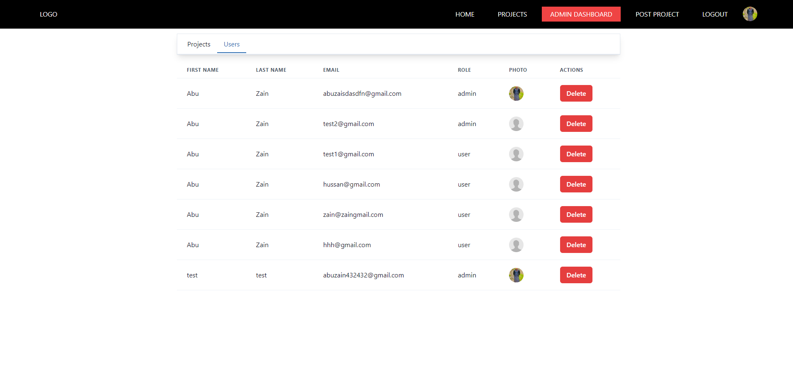
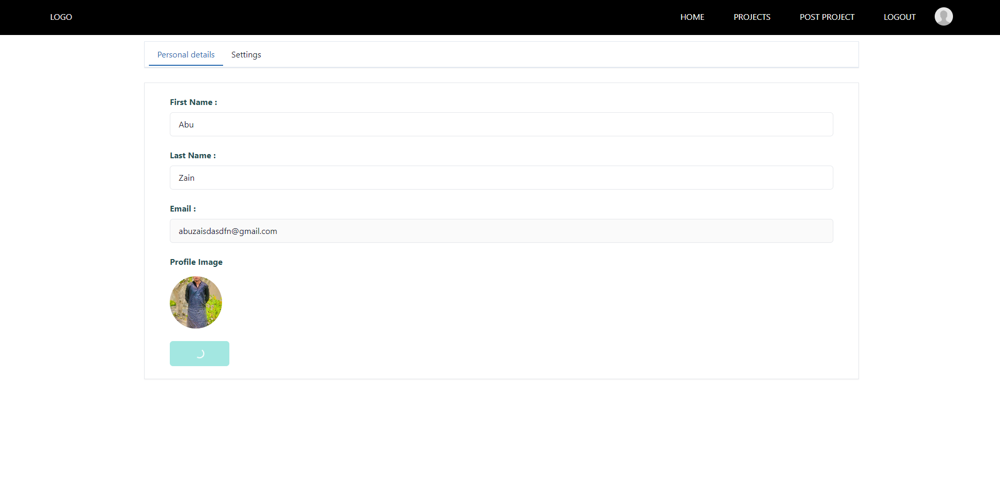
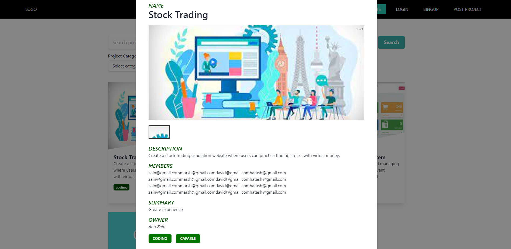
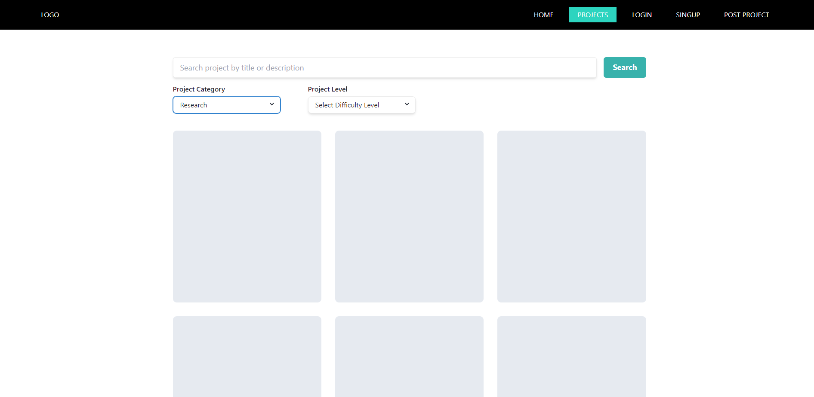

# Technologies Used

## Frontend:
### React, Redux Toolkit, Redux Toolkit Query

## Backend: 
### Node.js, Express Database: MongoDB

# Note:
### if you are looking for a project where you can learn Redux Toolkit Query, React routing , React router 6, React Protected route, User authentication and so much more then this project  is best option 

### CodeFair is a dynamic and feature-rich web application designed to facilitate collaboration and showcase a diverse range of coding and development projects. Built using cutting-edge technologies, including MongoDB, Node.js, Express, and React, CodeFair empowers users to perform Create, Read, Update, and Delete (CRUD) operations while ensuring the highest standards of security and web development practices.

# Key Features
### CodeFair offers an array of features, catering to both users and administrators. Here are some of the highlights:

# For Users:

## View Projects:
### Users can browse through a wide variety of projects, each categorized by difficulty levels (Proficient, Capable, Developing, Novice) and project type (Poster, Coding, Data Science, Research).

## Create Projects:
### Users can post their own projects, complete with descriptions and project details, making it a hub for showcasing their skills and accomplishments.

## Manage Projects:
### Users have full control over their projects, allowing them to update project details, upload project screenshots, and even deactivate their project listings.

## User Profiles:
### Users can update their personal information and manage their project listings from their user profiles.

## Sorting and Filtering:
### Users can easily sort and filter projects based on difficulty level and project type.

## Project Details:
### Users can click on specific projects to view in-depth details, fostering engagement and collaboration.

# For Administrators:

## Administrative Rights:
### Admins have the authority to remove any projects and users, ensuring a secure and well-maintained platform.

## Many-to-Many Collaboration
### One of the standout features of CodeFair is its support for a many-to-many relationship between users and projects. Users can create multiple projects, and projects can involve up to four participants for coding projects. This flexibility encourages collaboration and showcases the diversity of skills and talents within the coding and development community.

## Get Started
### You can easily get started with CodeFair by following the setup instructions in the vite's documentation. Whether you're a developer looking to contribute or a user seeking to showcase your projects, CodeFair provides a secure and user-friendly platform for all.
### CodeFair is a testament to the power of modern web development technologies and practices, offering a vibrant ecosystem for coding enthusiasts to connect, collaborate, and thrive. Start exploring and sharing your projects today!
